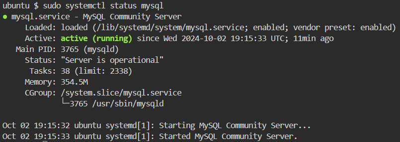

## Installing MySQL

MySQL is a popular relational database management system used for web and server applications. Let’s begin by installing MySQL.

### Step 1: Update the package list

First, ensure that your package list is updated by running the following command:

`sudo apt update`{{exec}}

### Step 2: Install MySQL server using the following command:

`sudo apt install mysql-server -y`{{exec}}

### Step 3: Secure MySQL Installation

Once MySQL is installed, run the security script to set a root password and configure security settings.

`sudo mysql_secure_installation`{{exec}}

Follow the prompts to set up a root password and configure security options (it's recommended to answer Y to most of the options).

### Step 4: Start and Verify MySQL Service

Ensure that the MySQL service is running properly by starting it and checking its status:

`sudo systemctl start mysql`{{exec}}

`sudo systemctl status mysql`{{exec}}

If you see something like this, it proves that your installation was successful.

### Step 5: Log in to MySQL

You can now log in to MySQL using the root account:

`sudo mysql -u root -p`{{exec}}

Press enter for no password

### Step 6: Create a Test Database and User

Inside the MySQL shell, you can create a test database and a new user:

`CREATE DATABASE test_db;`{{exec}}

`CREATE USER 'test_user'@'localhost' IDENTIFIED BY 'password';`{{exec}}

`GRANT ALL PRIVILEGES ON test_db.* TO 'test_user'@'localhost';`{{exec}}

`FLUSH PRIVILEGES;`{{exec}}

`EXIT;`{{exec}}

