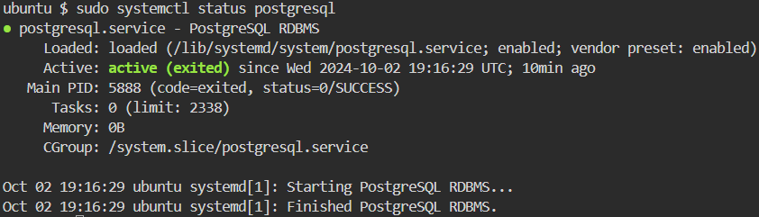

## Installing PostgreSQL

PostgreSQL is a powerful, open-source object-relational database system. Let’s move on to installing PostgreSQL.

### Step 1: Install PostgreSQL

`sudo apt install postgresql postgresql-contrib -y`{{exec}}

### Step 2: Start and Check PostgreSQL Service

`sudo systemctl start postgresql`{{exec}}

`sudo systemctl status postgresql`{{exec}}

If you see something like this, it proves that your installation was successful.

### Step 3: Switch to PostgreSQL User

In PostgreSQL, you typically interact with the database using the postgres user. Switch to the PostgreSQL user with this command:

`sudo -i -u postgres`{{exec}}

### Step 4: Access PostgreSQL Shell

Access the PostgreSQL shell by typing:

`psql`{{exec}}

### Step 5: Create a Test Database and User

Inside the PostgreSQL shell, create a new database and user:

`CREATE DATABASE test_db;`{{exec}}

`CREATE USER test_user WITH PASSWORD 'password';`{{exec}}

`GRANT ALL PRIVILEGES ON DATABASE test_db TO test_user;`{{exec}}

`\q`{{exec}}

### Step 6: Exit the PostgreSQL User Session

`exit`{{exec}}

